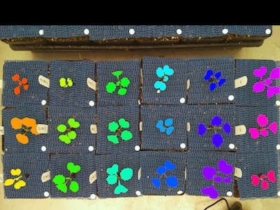
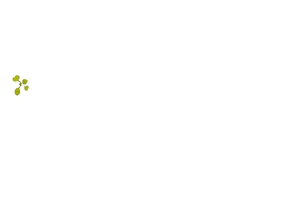

## Cluster Contours and Split Images

This function takes clustered contours and splits them into multiple images, also does a check to make sure that
the number of inputted filenames matches the number of clustered contours.

**cluster_contour_splitimg**(*device,img,grouped_contour_indexes,contours,outdir,file=None, filenames=None,debug=None*)

**returns** device, output_paths

- **Parameters:**
    - device= Counter for image processing steps
    - img= image object to be masked
    - grouped_contour_indexes= output of cluster_contours, indexes of clusters of contours
    - contours= contours to cluster, output of cluster_contours
    - outdir= directory for output images
    - file= the name of the input image to use as a base name , output of filename from read_image function
    - filenames= input txt file with list of filenames in order from top to bottom left to right (likely list of genotypes)
    - debug= None, "print", or "plot". Print = save to file, Plot = print to screen. Default = None
- **Context:**
    - 
- **Example use:**
    - [Use In Multi-Plant Tutorial](multi-plant_tutorial.md)


**Output of Cluster Contours**




```python
import plantcv as pcv

# Cluster Contours and Split into Separate Images 
out = './examples/'
device, output_path = pcv.cluster_contour_splitimg(device, img1, clusters_i, contours, out, filename, names=None,
                                                       debug="print")
```

**Split the Clusters into Separate Images (example of a few images)**




