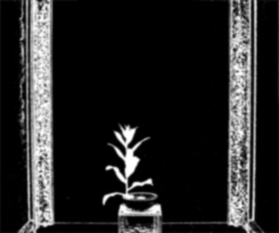

## Gaussian Blur

Applies a gaussian blur filter. Applies median value to central pixel within a kernel size (ksize x ksize). 
The function is a wrapper for the OpenCV function [gaussian blur](http://docs.opencv.org/2.4/modules/imgproc/doc/filtering.html?highlight=gaussianblur#gaussianblur).  

**gaussian_blur**(*device,img, ksize, sigmax=0,sigmay=None, debug=None*)**

**returns** device, blurred image

- **Parameters:**
    - device - Counter for image processing steps
    - img - img object
    - ksize - kernel size => ksize x ksize box, e.g. (5,5) 
    - sigmax - standard deviation in X direction; if 0, calculated from kernel size
    - sigmay - standard deviation in Y direction; if sigmaY is None, sigmaY is taken to equal sigmaX
    - debug - None, "print", or "plot". Print = save to file, Plot = print to screen. Default = None
- **Context:**
    - Used to reduce image noise

**Original image**


```python
from plantcv import plantcv as pcv

# Apply gaussian blur to a binary image that has been previously thresholded.
device, gaussian_img = pcv.gaussian_blur(device, img=img1, ksize=(51,51), sigmax=0, sigmay=None, debug='print')
```

**Gaussian blur (ksize = (51,51))**



```python
from plantcv import plantcv as pcv

# Apply gaussian blur to a binary image that has been previously thresholded.
device, gaussian_img = pcv.gaussian_blur(device, img=img1, ksize=(101,101), sigmax=0, sigmay=None, debug='print')
```

**Gaussian blur (ksize = (101,101))**


