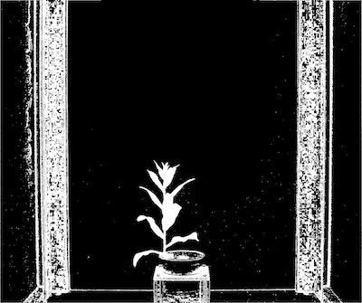

## Gaussian Blur

Applies a gaussian blur filter. Applies median value to central pixel within a kernel size (ksize x ksize). 
The function is a wrapper for the OpenCV function [gaussian blur](http://docs.opencv.org/2.4/modules/imgproc/doc/filtering.html?highlight=gaussianblur#gaussianblur).  

**plantcv.gaussian_blur**(*img, ksize, sigmax=0, sigmay=None*)

**returns** blurred image

- **Parameters:**
    - img - RGB or grayscale image data
    - ksize - Tuple of kernel dimensions, e.g. (5, 5)
    - sigmax - standard deviation in X direction; if 0, calculated from kernel size
    - sigmay - standard deviation in Y direction; if sigmaY is None, sigmaY is taken to equal sigmaX
- **Context:**
    - Used to reduce image noise

**Original image**



```python
from plantcv import plantcv as pcv

# Set global debug behavior to None (default), "print" (to file), or "plot" (Jupyter Notebooks or X11)
pcv.params.debug = "print"

# Apply gaussian blur to a binary image that has been previously thresholded.
gaussian_img = pcv.gaussian_blur(img=img1, ksize=(51,51), sigmax=0, sigmay=None)
```

**Gaussian blur (ksize = (51,51))**


```python
from plantcv import plantcv as pcv

# Set global debug behavior to None (default), "print" (to file), or "plot" (Jupyter Notebooks or X11)
pcv.params.debug = "print"

# Apply gaussian blur to a binary image that has been previously thresholded.
gaussian_img = pcv.gaussian_blur(img=img1, ksize=(101,101), sigmax=0, sigmay=None)
```

**Gaussian blur (ksize = (101,101))**


