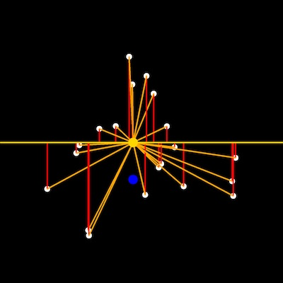
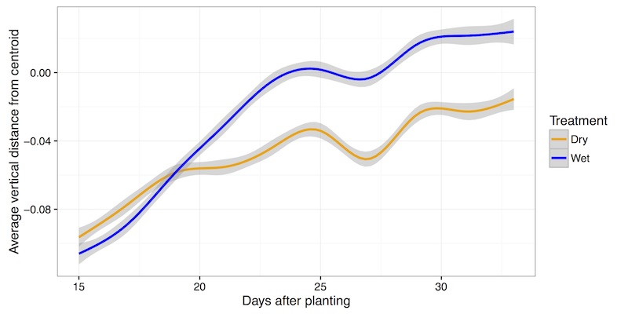

## Landmark_reference_pt_dist

This is a function to measure the distance from user defined points to the centroid and a point defined by the centroid coordinate along the x-axis and baseline coordinate (top of pot) along the y-axis. Calculating the vertical distance between leaf tip points to the centroid of the plant object in side-view images may provide a proxy measure of turgor pressure.
 
**plantcv.landmark_reference_pt_dist**(*points_r, centroid_r, bline_r*)

**returns** landmark_header, landmark_data (which contains ave_vertical_distance_from_centroid, ave_horizontal_distance_from_centroid, 
ave_euclidean_distance_from_centroid, average_angle_between_landmark_point_and_centroid, ave_vertical_distance_from_baseline, 
ave_horizontal_distance_from_baseline, ave_euclidean_distance_from_baseline, average_angle_between_landmark_point_and_baseline)

- **Parameters:**
    - points_r - A list of tuples representing rescaled landmark points
    - centroid_r - A tuple representing the rescaled centroid point
    - bline_r - A tuple representing the rescaled baseline point
- **Context:**
    - Used to estimate the distance and angles of landmark points relative to shape reference landmarks (centroid and pot height aka baseline)

**Input rescaled points, centroid and baseline points**



```python
from plantcv import plantcv as pcv

# Set global debug behavior to None (default), "print" (to file), 
# or "plot" (Jupyter Notebooks or X11)
pcv.params.debug = "print"

# Identify acute vertices (tip points) of an object
# Results in set of point values that may indicate tip points
landmark_header, landmark_data = pcv.landmark_reference_pt_dist(points_r, centroid_r, 
                                                                bline_r)

```

**Representation of many data points collected in two treatment blocks throughout time**


