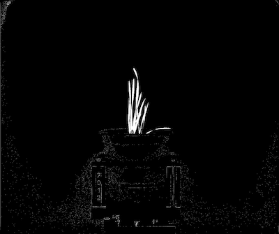
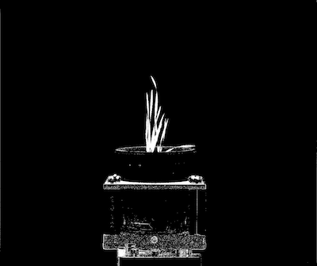
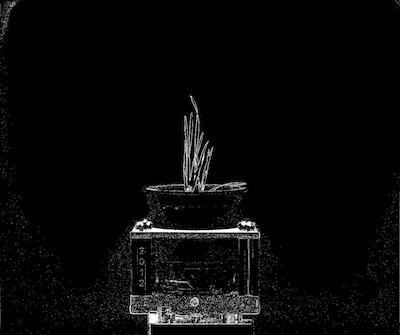

## Logical Operations - XOR

Join two images using the bitwise XOR operator (difference between the two images). Images must be the same size. 
This is a wrapper for the Opencv Function [bitwise_xor](https://docs.opencv.org/2.4/modules/core/doc/operations_on_arrays.html#bitwise-xor).  

**logical_xor**(*bin_img1, bin_img2*)

**returns** ='xor' image

- **Parameters:**
    - bin_img1 - Binary image data to be compared to bin_img2.
    - bin_img2 - Binary image data to be compared to bin_img1.
- **Context:**
    - Used to combine to images. Very useful when combining image channels that have been thresholded seperately.
- **Example use:**
    - [Use In VIS Tutorial](vis_tutorial.md)

**Input binary image 1**



**Input binary image 2**



```python
from plantcv import plantcv as pcv

# Set global debug behavior to None (default), "print" (to file), 
# or "plot" (Jupyter Notebooks or X11)

pcv.params.debug = "print"

# Combine two images that have had different thresholds applied to them.
# For logical 'and' operation object pixel must be in both images 
# to be included in 'and' image.
xor_image = pcv.logical_xor(s_threshold, b_threshold)

```

**Combined image**


