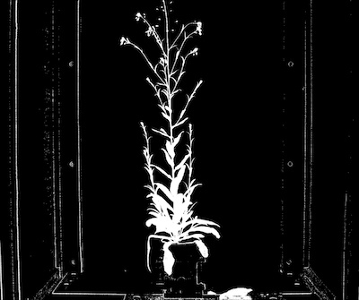

## Naive Bayes Classifier

Creates a binary (labeled) image from a color image based on the learned statistical information from
a training set. From the training set we calculate the probability density function (PDF) for the Random Variables
Plant (P) and Background (B), each containing the Random Variables Hue (H), Saturation (S), and Value (V)
(color channels). Given these PDFs, we calculate the joint probability a pixel is from the Random Variable P or B using
Bayes Theorem with the naive assumption that the Random Variables are independent (for convenience). Output pixels are
labeled as plant (255) or background (0) if P(Pixel = plant) > P(Pixel = background).

**plantcv.naive_bayes_classifier(*rgb_img, pdf_file*)**

**returns** mask

- **Parameters:**
    - rgb_img - RGB image data
    - pdf_file - (str): output file containing PDFs from `plantcv-train.py`
   
- **Context:**
    - Used to help differentiate plant and background
- **Example use:**
    - [Use In Machine Learning Tutorial](machine_learning_tutorial.md)
    
**Original image**


```python
from plantcv import plantcv as pcv

# Set global debug behavior to None (default), "print" (to file), or "plot" (Jupyter Notebooks or X11)
pcv.params.debug = "print"

# Create binary image from a gray image based on threshold values. Targeting light objects in the image.
mask = pcv.naive_bayes_classifier(img, "naive_bayes_pdfs.txt")
```

The output mask is a dictionary with the keys being the class names and the values being the corresponding binary masks.

**Binary mask image**


