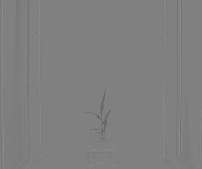

## Otsu Threshold

Creates a binary image from a gray image based on the threshold values. 

**otsu_auto_threshold(*img, maxValue, object_type, device, debug=None*)**

**returns** device, thresholded image

- **Parameters:**
    - img - grayscale img object
    - maxValue - value to apply above threshold (255 = white)
    - objecttype - 'light' or 'dark', is target image light or dark?
    - device- Counter for image processing steps
    - debug- None, "print", or "plot". Print = save to file, Plot = print to screen. Default = None
- **Context:**
    - Used to help differentiate plant and background

**Grayscale image (green-magenta channel)**




```python
import plantcv as pcv

# Create binary image from a gray image based on threshold values. Targeting light objects in the image.
device, threshold_light = pcv.otsu_auto_threshold(img, 255, 'dark', device, debug="print")
```

**Thresholded image**


**Grayscale image (blue-yellow channel)**


```python
import plantcv as pcv

# Create binary image from a gray image based on threshold values. Targeting dark objects in the image.
device, threshold_dark = pcv.otsu_auto_threshold(img1, 255, 'light', device, debug="print")
```

**Thresholded image (inverse)**


