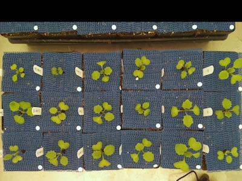

## Shift Image

Shifts image, but keeps dimensions the same

**plantcv.shift_img**(*img, number, side='right'*)

**returns** image after shift

- **Parameters:**
    - img - RGB or grayscale image data
    - number - number(int) of rows or columns to add
    - side - "top", "bottom", "right", "left" where to add the rows or columns (default: "right")
- **Context:**
    - Shifts image from the specified direction.
- **Example use:**
    - [Use In Multi-Plant Tutorial](multi-plant_tutorial.md)
    
**Input image**


```python

from plantcv import plantcv as pcv

# Set global debug behavior to None (default), "print" (to file), 
# or "plot" (Jupyter Notebooks or X11)
pcv.params.debug = "print"

# Shift image
shifted_img = pcv.shift_img(img, 300, "top")

```

**Image after shift**


