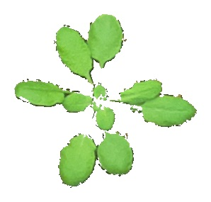
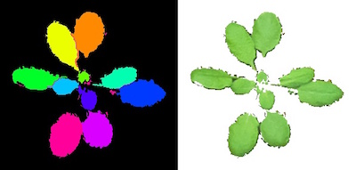

## Watershed Segmentation

This function is based on code contributed by Suxing Liu, Arkansas State University.
For more information see [https://github.com/lsx1980/Leaf_count](https://github.com/lsx1980/Leaf_count).
This function uses the watershed algorithm to detect boundary of objects.
Needs a mask file which specifies area which is object is white, and background is black.
Requires cv2 version 3.0+

**plantcv.watershed_segmentation**(*rgb_img, mask, distance=10*)**

**returns** watershed_header, watershed_data, analysis_images

- **Parameters:**
    - rgb_img - RGB image data
    - mask - binary image, single channel, object in white and background black
    - distance - min_distance of local maximum, lower values are more sensitive, and segments more objects (default: 10)
    - filename - if user wants to output analysis images change filenames from False (default)
- **Context:**
    - Used to segment image into parts

**Original image**



```python

from plantcv import plantcv as pcv

# Set global debug behavior to None (default), "print" (to file), or "plot" (Jupyter Notebooks or X11)
pcv.params.debug = "print"

# Segment image with watershed function
watershed_header, watershed_data, analysis_images = pcv.watershed_segmentation(crop_img, thresh, 10)

print(watershed_header)
print(watershed_data)
```

**Watershed Segmentation**



```python

('HEADER_WATERSHED', 'estimated_object_count')  
('WATERSHED_DATA', 10)
```
