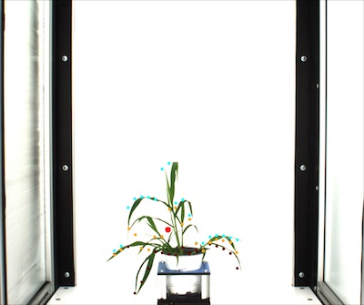

## x_axis_pseudolandmarks

Divide plant object into twenty equidistant bins and assign pseudolandmark points based upon their actual (not scaled) position
Once this data is scaled this approach may provide some information regarding shape independent of size

**x_axis_pseudolandmarks**(*obj, mask, img, device, debug=None*)

**returns** device, landmarks_on_top (top), landmarks_on_bottom (bottom), landmarks_at_center_along_the_vertical_axis (center_V)

- **Parameters:**
    - obj - A contour of the plant object (this should be output from the object_composition.py fxn)
    - mask - This is a binary image. The object should be white and the background should be black
    - img - A copy of the original image generated using np.copy if debug is true it will be drawn on
    - device - Counter for image processing steps
    - debug- None, "print", or "plot". Print = save to file, Plot = print to screen. Default = None
- **Context:**
    - Used to identify a set of sixty equidistant landmarks on the horizontal axis. Once scaled these can be used for shape analysis.
    
**Input object contour and image**


```python
import plantcv as pcv

device = 1

# Identify a set of land mark points
# Results in set of point values that may indicate tip points
device, top, bottom, center_v = pcv.x_axis_pseudolandmarks(obj, mask, img, device, debug='print')
```

**Image of points selected**


